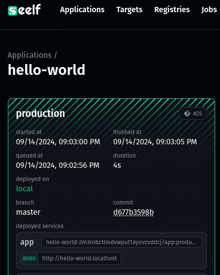

# Local Run

To trigger a new deployment locally use the following command:

```
./entrypoint.sh http://localhost:8222 some_secret_token 2m3RoBCt0ndVwpUt1ayOVZvDDcJ production master
```

The app-id `2m3RoBCt0ndVwpUt1ayOVZvDDcJ` can be found when accessing the setup application from the `seelf` dashboard. The following screenhsot opens via `http://localhost:8222/apps/2m3RoBCt0ndVwpUt1ayOVZvDDcJ/`

